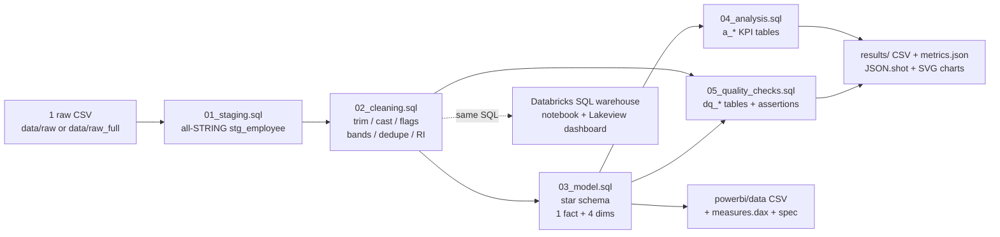

# da-learn-02 - HR employee attrition (SQL cleaning -> star schema -> KPIs -> dashboards)

**Data Analyst learning series, project 02.** An end-to-end analyst workflow on the real
**IBM HR Analytics Employee Attrition & Performance** dataset (1,470 employees, 35 columns): SQL data cleaning, a star-schema model,
business KPI analysis, data-quality evidence, and dashboard packages for **Databricks** and **Power BI**.

* SQL is written in the **Databricks / Spark SQL dialect** and executed locally on **DuckDB** (a 4-macro shim file covers the differences).
* All results come from the **full dataset** run. Git contains a reproducible 78-employee subset of the raw data (see [Dataset](#dataset)).
* **Databricks:** schema `workspace.da_learn_02`, published Lakeview dashboard (see [Databricks run](#databricks-run-2026-10-02)). Power BI: **kit** (a `.pbix` cannot be built on Linux).


## Business questions
1. What is the overall attrition rate, and how do leavers differ from stayers on pay and tenure?
2. Does overtime drive attrition? By how much versus non-overtime staff?
3. Which departments and job roles lose people fastest?
4. How do tenure, age, income, job satisfaction, and travel frequency relate to leaving?
5. How clean is the source file, and what had to be standardised?

## Pipeline


## Key insights (full data)
| # | Insight |
|---|---|
| 1 | **16.12 % attrition** (237 / 1,470). Leavers earn **$4,787** vs stayers **$6,833** monthly and stay **5.13** vs **7.37** years. |
| 2 | **Overtime nearly triples risk:** OverTime attrition **30.53 %** vs **10.44 %** without OT (416 OT employees). |
| 3 | **Hot spots:** Sales dept **20.63 %**, HR **19.05 %**, R&D **13.84 %**. Sales Representative L1 **42.11 %** (32/76); Lab Technician L1 **28.0 %** (56/200); tenure <2 y **34.88 %**. |
| 4 | **Protective factors:** Non-Travel **8.0 %** vs Travel_Frequently **24.91 %**; Very High job satisfaction **11.33 %** vs Low **22.84 %**; income 15k+ **3.76 %** vs <3k **28.61 %**. |

Full write-up with data-quality findings: [`results/RESULTS.md`](results/RESULTS.md).

## Dataset
| | |
|---|---|
| Name | IBM HR Analytics Employee Attrition & Performance |
| Original (Kaggle) | https://www.kaggle.com/datasets/pavansubhasht/ibm-hr-analytics-attrition-dataset |
| License | **ODbL** (database) + **DbCL** (contents), per IBM AIF360 notes |
| Mirror used | https://raw.githubusercontent.com/IBM/employee-attrition-aif360/master/data/emp_attrition.csv (SHA-256 pinned; UTF-8 BOM stripped) |
| Full size used | 1 CSV, ~228 KB, **1,470 rows × 35 columns** |
| In git | **Subset** in `data/raw/` (78 employees) built by `scripts/make_sample.py` with `EmployeeNumber % 20 = 1`. Details: [`data/README.md`](data/README.md) |

## How to run
```bash
pip install -r requirements.txt
python run_pipeline.py --source sample
python scripts/download_full_data.py
python run_pipeline.py --source full
python scripts/build_databricks.py --with-dashboard
```

## Databricks run (2026-10-02)
| Object | Workspace path |
|---|---|
| Raw CSV (full) | `/Volumes/workspace/da_learn_02/raw/` |
| Tables | `workspace.da_learn_02` |
| Notebook | `/Workspace/Shared/da-learn-02-hr-employee-attrition/hr_pipeline_notebook` |
| Dashboard (published) | "da-learn-02 HR employee attrition" |

Executed 2026-10-02 IST: all 7 core table counts match DuckDB; KPI match except median income (Databricks 4,908 vs DuckDB 4,919).

## Complete dataset
| | |
|---|---|
| Kaggle page | https://www.kaggle.com/datasets/pavansubhasht/ibm-hr-analytics-attrition-dataset |
| Mirror URL | https://raw.githubusercontent.com/IBM/employee-attrition-aif360/master/data/emp_attrition.csv |
| Alternate name | `WA_Fn-UseC_-HR-Employee-Attrition.csv` |
| Licence | **Open Database License (ODbL)** + **Database Contents License (DbCL)** (documented by IBM AIF360) |
| Size | ~228 KB; **1,470 rows**, **35 columns** |
| File list | `emp_attrition.csv` |
| Download | `python scripts/download_full_data.py` → `data/raw_full/emp_attrition.csv` |
